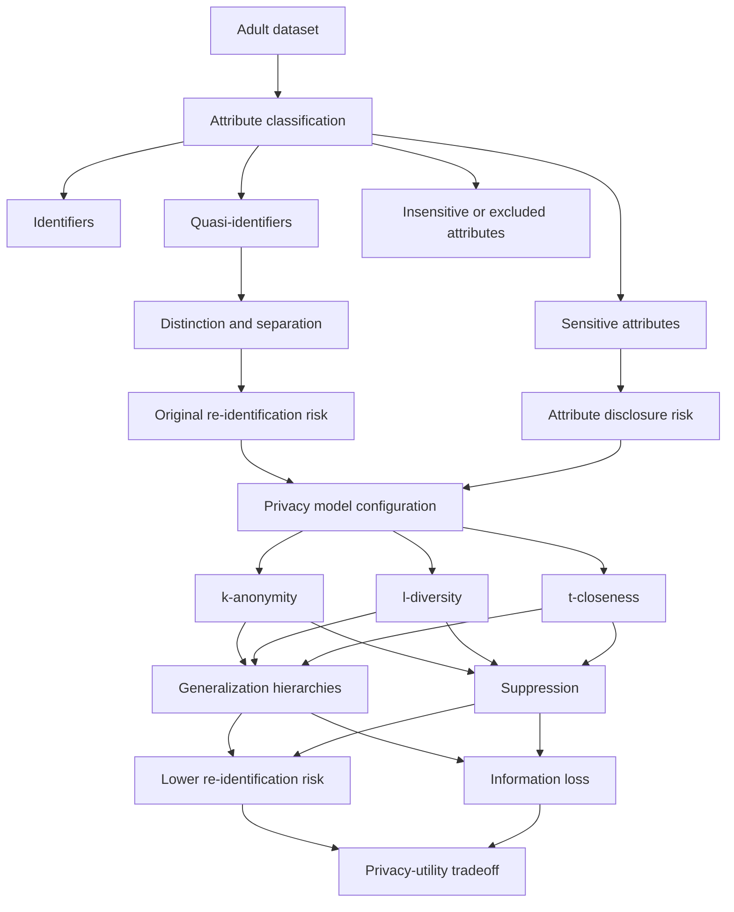
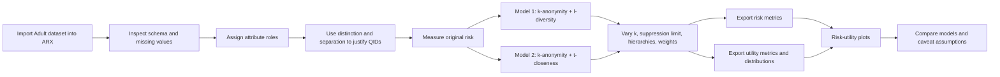
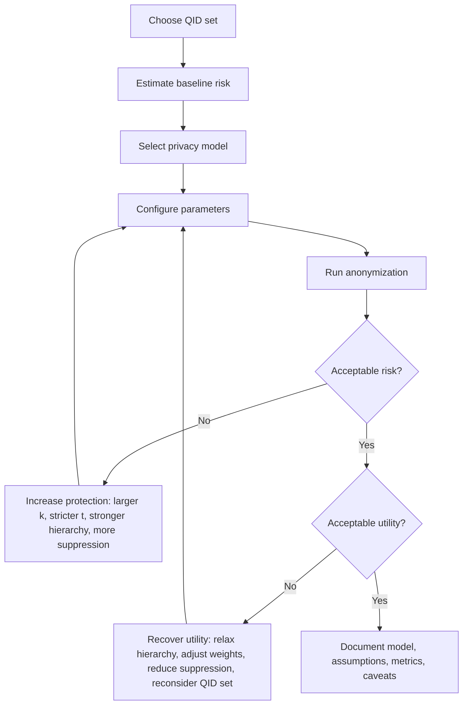

# ARX Anonymization, Risk, and Utility on the Adult Dataset

## Executive Summary

**Assignment claim.** The source document is an assignment brief, not a research paper. It asks for an ARX project using the Adult dataset, classification of attributes into privacy roles, baseline re-identification risk analysis, two anonymization models, and plots showing how privacy and utility change as model parameters vary. Citation: `new/Assignment3-Anonymization_of_a_Dataset.pdf`, p. 1.

**Dataset/source fact.** The local Adult dataset documentation describes Census-income records extracted from a 1994 Census database. It reports 48,842 instances total, split into 32,561 training rows and 16,281 test rows, with 45,222 rows remaining if unknown values are removed. Citation: `new/data/adult/adult.names`, lines 1-10.

**Background explanation.** The core concept is the privacy-utility tradeoff: transformations such as generalization and suppression can reduce re-identification risk, but they also remove detail that may be useful for analysis. ARX supports structured-data anonymization, privacy models such as k-anonymity, l-diversity, and t-closeness, and risk/utility analysis. Source: [ARX overview](https://arx.deidentifier.org/overview/) and [ARX criteria documentation](https://arx.deidentifier.org/help-criteria/).

**Interpretation.** A strong report for this assignment should be cautious: it should separate what the assignment asks for, what the Adult dataset files establish, what existing ARX project files show, and what is inferred from anonymization background knowledge. It should not claim legal anonymization or GDPR/RGPD compliance from ARX metrics alone.

## Glossary

| Term | Type | Meaning |
|---|---|---|
| ARX | Background explanation | An open-source tool for anonymizing structured tabular data and analyzing re-identification risk and data quality. Source: [ARX overview](https://arx.deidentifier.org/overview/). |
| Anonymization | Background explanation | Transformation of data to make individuals harder to identify while preserving useful aggregate or analytical structure. |
| Identifier | Background explanation | A direct identifier such as name, email, phone number, national ID, or exact account number. |
| Quasi-identifier (QID) | Background explanation | A field that may not identify a person alone but can do so when combined with other fields or outside knowledge, such as age, sex, country, occupation, or marital status. |
| Sensitive attribute | Background explanation | A field whose disclosure could reveal private or harmful information, such as income or health status. |
| Insensitive attribute | Background explanation | A field not treated as identifying or sensitive for the chosen release scenario. This is a modeling decision, not an inherent property. |
| Distinction | Background explanation | A QID discovery idea used to reason about how much an attribute or attribute set makes records distinct from each other. Higher distinction suggests more identifying power. |
| Separation | Background explanation | A QID discovery idea used to reason about how strongly an attribute or attribute set separates records into distinguishable groups. |
| Re-identification risk | Background explanation | The estimated risk that a released record can be linked to a person. ARX discusses risk metrics for prosecutor, journalist, and marketer attack models. Source: [ARX anonymization tool](https://arx.deidentifier.org/anonymization-tool/). |
| Equivalence class | Background explanation | A group of records sharing the same transformed QID values. k-anonymity constrains the minimum size of these groups. |
| k-anonymity | Background explanation | A privacy model requiring each QID pattern to appear in at least `k` records. It targets identity disclosure but does not, by itself, guarantee sensitive-value diversity. |
| l-diversity | Background explanation | A privacy model that adds diversity constraints over sensitive values within equivalence classes. ARX associates l-diversity with specific sensitive attributes. Source: [ARX criteria documentation](https://arx.deidentifier.org/help-criteria/). |
| t-closeness | Background explanation | A privacy model requiring the sensitive-value distribution within an equivalence class to remain close to the overall sensitive-value distribution. Smaller `t` is stricter. |
| Suppression | Background explanation | Removing records or values when they cannot satisfy the privacy model under the chosen transformations. |
| Generalization | Background explanation | Replacing detailed values with broader categories, such as exact ages with age bands or countries with regions. |
| Hierarchy / coding model | Assignment claim + background explanation | The assignment asks for definition and configuration of coding models, such as hierarchies. In ARX, hierarchies define allowed generalization levels. Citation: assignment PDF, p. 1; ARX configuration docs. |
| Utility metric | Background explanation | A measurement of how useful the anonymized dataset remains, such as information loss, distribution similarity, discernibility, or downstream model performance. |

## Source Walkthrough

### Problem Statement

**Assignment claim.** The goal is to anonymize a larger dataset, specifically the Adult dataset, using ARX. Citation: assignment PDF, p. 1.

**Interpretation.** The learning objective is not just to produce an anonymized file. It is to reason about which attributes create linkage risk, which attributes require disclosure protection, and how anonymization settings shift the balance between privacy and utility.

### Required Deliverables

**Assignment claim.** The required submission has two parts:

- an ARX project with anonymization models applied;
- a document of at most 5 pages explaining attribute classification plus risk and utility plots and analysis.

Citation: assignment PDF, p. 1, "Submit in moodle" paragraph.

### Required Method

**Assignment claim.** The workflow is:

1. Create a new ARX project and import the Adult dataset.
2. Classify attributes as identifying, QID, sensitive, or insensitive, considering distinction and separation.
3. Characterize re-identification risk in the original dataset.
4. Apply two anonymization models.
5. Compare original and anonymized re-identification risk.
6. Measure utility with suitable metrics and/or distribution analysis.
7. Plot risk and utility as privacy-model parameters vary, such as `k`, suppression limit, or coding model.
8. Iterate if the results are unsatisfactory.

Citation: assignment PDF, p. 1, numbered items 1-5.

### Evaluation Criteria

**Assignment claim.** The grading rubric weights the work as follows:

| Criterion | Weight |
|---|---:|
| Attribute classification and justification | 15% |
| Coding models, including hierarchies | 20% |
| Privacy models, utility, and risk assessment | 50% |
| Structure and organization, including AI documentation if applicable | 15% |

Citation: assignment PDF, p. 1, "Evaluation Criteria."

### Source Limitations

**Dataset/source fact.** The PDF appears to be a single-page assignment handout. It contains no embedded figures or experimental tables beyond the text bullets and grading criteria.

**Interpretation.** Because the source is not a research paper, a report should avoid phrases like "the paper proves" or "the paper demonstrates." Better wording is "the assignment asks," "the dataset documentation states," or "ARX background suggests."

## Adult Dataset Context

**Dataset/source fact.** The local schema lists these fields: `age`, `workclass`, `fnlwgt`, `education`, `education-num`, `marital-status`, `occupation`, `relationship`, `race`, `sex`, `capital-gain`, `capital-loss`, `hours-per-week`, `native-country`, and `income`. Citation: `new/data/adult/metadata.txt`; `new/data/adult/adult.names`, lines 95-110.

**Dataset/source fact.** The prediction target is whether income is `>50K` or `<=50K`. Citation: `new/data/adult/adult.names`, lines 13-15 and 110.

**Dataset/source fact.** Missing values are indicated for `workclass`, `occupation`, and `native-country`; the Adult documentation states 7% of records have missing values. Citation: `new/data/adult/metadata.txt`; `new/data/adult/adult.names`, lines 63-67.

**Interpretation.** A defensible starting classification for learning purposes is:

| Attribute group | Candidate fields | Claim status |
|---|---|---|
| Direct identifiers | none obvious in the local schema | Interpretation from schema inspection |
| QIDs | `age`, `workclass`, `education` or `education-num`, `marital-status`, `occupation`, `relationship`, `race`, `sex`, `hours-per-week`, `native-country` | Interpretation; should be justified with distinction/separation and attack assumptions |
| Sensitive | `income`; possibly `capital-gain` and `capital-loss` if the release scenario treats financial values as sensitive | Interpretation |
| Insensitive/excluded | `fnlwgt`; one of `education` or `education-num` because they duplicate information | Interpretation |

**Caution.** Attribute roles are contextual. For example, `race` and `sex` can be QIDs, sensitive attributes, protected demographic variables for fairness analysis, or all three depending on the release purpose and threat model. ARX requires a practical modeling choice, but the report should explain the choice instead of presenting it as universal truth.

## Concept Map

**Interpretation.** The diagram is explanatory, not a figure from the source. It shows how the assignment's pieces fit together: classify fields, measure baseline risk, configure privacy models, transform the data, then compare privacy gains against utility loss.

## Method Diagram

**Assignment claim.** The assignment requires two anonymization models and risk/utility plots over parameter settings. Citation: assignment PDF, p. 1.

**Existing-project observation.** The local `.deid` archives already contain two ARX project configurations that match this style: `old/K+L.deid` uses `5-anonymity` plus distinct `2-diversity` for `race` and `salary-class`; `old/K+T.deid` uses `5-anonymity` plus `0.2-closeness` for `salary-class` and `race`. Citation: `old/K+L.deid` and `old/K+T.deid`, `input/config.xml`.

## Privacy-Utility Workflow

**Background explanation.** This loop is typical of applied anonymization work: privacy settings are adjusted until the residual risk and utility loss are acceptable for the release scenario.

**Caution.** "Acceptable" is not defined by the assignment. The report must make the chosen thresholds explicit.

## Evidence Table

| Topic | Evidence | Claim type | What it supports |
|---|---|---|---|
| Assignment scope | `new/Assignment3-Anonymization_of_a_Dataset.pdf`, p. 1 | Assignment claim | Use Adult dataset in ARX; classify attributes; analyze original risk; apply two anonymization models; compare risk and utility. |
| Deliverables | Assignment PDF, p. 1 | Assignment claim | Submit an ARX project and a report of at most 5 pages. |
| Grading | Assignment PDF, p. 1 | Assignment claim | Privacy/utility/risk assessment is the largest criterion at 50%. |
| Dataset origin | `new/data/adult/adult.names`, lines 1-20 | Dataset/source fact | Adult is Census-income data extracted from a 1994 Census database. |
| Dataset size | `new/data/adult/adult.names`, lines 7-10 | Dataset/source fact | 48,842 total records; 32,561 train; 16,281 test; 45,222 after removing unknowns. |
| Dataset schema | `new/data/adult/metadata.txt`; `new/data/adult/adult.names`, lines 95-110 | Dataset/source fact | Adult has 14 feature fields plus income/class target. |
| Missing values | `new/data/adult/metadata.txt`; `new/data/adult/adult.names`, lines 63-67 | Dataset/source fact | Missing values occur in `workclass`, `occupation`, and `native-country`; unknowns use `?`. |
| ARX subset in existing project | `old/K+L.deid`, `data/input.csv` header | Existing-project observation | The existing ARX project uses 9 columns: `sex`, `age`, `race`, `marital-status`, `education`, `native-country`, `workclass`, `occupation`, `salary-class`. |
| Existing attribute roles | `old/K+L.deid`, `input/definition.xml` | Existing-project observation | QIDs are `sex`, `age`, `marital-status`, `education`, `native-country`, `workclass`, and `occupation`; sensitive attributes are `race` and `salary-class`. |
| Existing K + L setup | `old/K+L.deid`, `input/config.xml` | Existing-project observation | Uses `5-anonymity` and distinct `2-diversity` for `race` and `salary-class`. |
| Existing K + T setup | `old/K+T.deid`, `input/config.xml` | Existing-project observation | Uses `5-anonymity` and `0.2-closeness` for `salary-class` and `race`. |
| ARX privacy models | [ARX criteria documentation](https://arx.deidentifier.org/help-criteria/) | Background explanation | k-anonymity/risk criteria apply to QIDs; l-diversity and t-closeness attach to sensitive attributes. |
| ARX risk analysis | [ARX anonymization tool](https://arx.deidentifier.org/anonymization-tool/) | Background explanation | ARX includes re-identification-risk metrics and population uniqueness estimates. |

## Caveats

**Assignment limitation.** The brief does not prescribe the exact two privacy models, utility metrics, risk thresholds, suppression limits, attribute weights, or hierarchy shapes. Those choices must be documented as design decisions.

**Dataset limitation.** The full Adult schema has 15 fields, but the existing ARX project archives use a 9-column subset. Any report should say whether it analyzes the full dataset or this reduced schema.

**Risk-model caveat.** Re-identification risk numbers are not self-explanatory. Each reported number should state the QID set, attacker model, population model, ARX configuration, suppression limit, and whether risk is measured before or after anonymization.

**Model caveat.** k-anonymity mainly targets identity disclosure. It can still leave attribute disclosure risk if all records in an equivalence class share the same sensitive value. That is why l-diversity or t-closeness may be useful when protecting `income` or other sensitive fields.

**t-closeness caveat.** Smaller `t` values are stricter. Claims that increasing `t` strengthens protection should be corrected unless ARX settings or plots clearly justify a different interpretation.

**Utility caveat.** Utility metrics differ in direction. Some metrics increase as quality improves, while information-loss metrics often increase as quality worsens. Define each metric before interpreting plots.

**Legal caveat.** ARX results can support a privacy analysis, but they do not by themselves prove legal anonymization or GDPR/RGPD compliance.

**Source caveat.** Because the primary source is an assignment prompt, not a research paper, it should not be treated as empirical evidence for the effectiveness of any anonymization model.

## Open Questions

1. Which exact release scenario is assumed: publishing data publicly, sharing with researchers, or submitting only an academic ARX project?
2. Which attacker model should be primary in ARX: prosecutor, journalist, marketer, or a population-uniqueness model?
3. Should `race` and `sex` be treated as QIDs, sensitive attributes, protected demographic variables for utility/fairness analysis, or some combination?
4. Should financial fields such as `capital-gain` and `capital-loss` be included, treated as sensitive, or excluded from the ARX project?
5. Should the report analyze the full Adult schema or the 9-column subset already present in the existing ARX project files?
6. What utility target matters most: preserving distributions, preserving classification performance for `income`, minimizing information loss, or preserving subgroup comparisons?
7. What threshold makes results "satisfying" for this assignment: maximum risk, minimum equivalence class size, maximum suppression, or acceptable distribution drift?

## Follow-Up Reading

- ARX overview: <https://arx.deidentifier.org/overview/>
- ARX privacy criteria: <https://arx.deidentifier.org/help-criteria/>
- ARX anonymization tool and risk analysis overview: <https://arx.deidentifier.org/anonymization-tool/>
- UCI Adult dataset page: <https://uci-ics-mlr-prod.aws.uci.edu/dataset/2/adult>
- Sweeney, "Achieving k-Anonymity Privacy Protection Using Generalization and Suppression."
- Machanavajjhala et al., "l-Diversity: Privacy Beyond k-Anonymity."
- Li, Li, and Venkatasubramanian, "t-Closeness: Privacy Beyond k-Anonymity and l-Diversity."

## Claim Label Checklist

**Assignment claims included.** Assignment scope, deliverables, method, evaluation criteria, and requested plots are cited to the PDF.

**Dataset/source facts included.** Dataset origin, size, schema, target field, and missing-value notes are cited to local Adult metadata files.

**Existing-project observations included.** The report mentions local `.deid` project schema and privacy-model configuration only where observed in zipped ARX project files.

**Background explanations included.** ARX, privacy models, and risk/utility concepts are labeled as background and cited to ARX documentation where possible.

**Interpretations included.** Attribute classification suggestions and workflow diagrams are labeled as interpretation rather than source claims.
